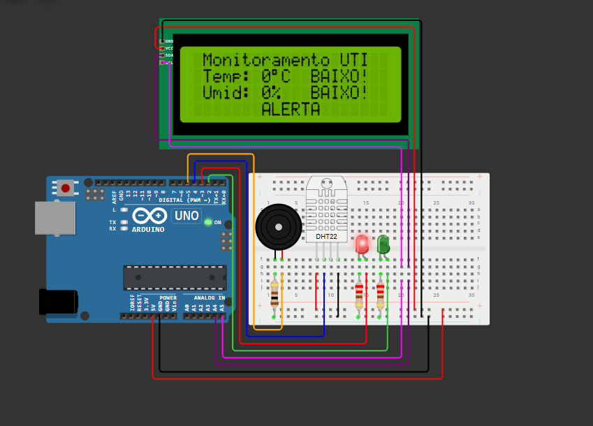
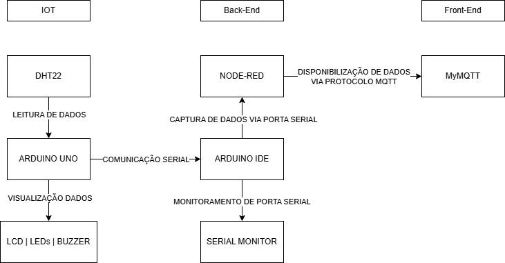

# Monitoramento de Temperatura e Umidade para UTIs
---
## 📝 Descrição do Projeto

Este projeto consiste em um sistema de monitoramento inteligente de temperatura e umidade para Unidades de Terapia Intensiva (UTIs) e centros cirúrgicos, utilizando a plataforma Arduino.

Ambientes críticos, como UTIs, exigem um rigoroso controle ambiental para garantir a segurança e conforto dos pacientes e a qualidade do atendimento. Automatizar o monitoramento desses parâmetros contribui para detectar rapidamente desvios, reduzir a sobrecarga da equipe de manutenção e prevenir falhas que possam impactar a saúde dos pacientes.

---
## 🎯 Objetivos

- Realizar o monitoramento contínuo de temperatura e umidade.
- Emitir alertas sonoros e visuais quando os parâmetros saírem das faixas ideais.
- Integrar o Arduino com plataformas de automação como Node-RED para facilitar a análise e gestão dos dados.
- Enviar dados ambientais para consumo externo via protocolo MQTT.

---
## 🔧 Especificações Técnicas

- **Microcontrolador:** Arduino Uno R3
- **Sensor:** DHT22 (temperatura e umidade)
- **Interface de Visualização:** Display LCD 20x4 com comunicação I2C
- **Alerta Sonoro:** Buzzer ativo 5V
- **Alertas Visuais:**  
  - LED Vermelho: Indica estado de alerta (temperatura ou umidade fora dos limites).
  - LED Verde: Indica estado normal (temperatura e umidade dentro dos limites).
- **Comunicação Serial:** Transmissão de dados para o Node-RED via Arduino IDE
- **Comunicação MQTT:** Disponibilização dos dados para consumo por aplicações externas (ex: MyMQTT)

---
## 💡 Protótipo (Wokwi)

- Link: https://wokwi.com/projects/429238239077641217
- 

---
## 📈 Diagrama do Sistema



---
## 📋 Descrição Detalhada do Diagrama

- **Camada IoT:** Responsável pela coleta de dados em tempo real (sensor DHT22) e pelas respostas locais imediatas (alerta sonoro e visual no buzzer e LCD).  
- **Camada Back-End:** 
  - O Arduino IDE é responsável por fornecer o código à maquina e disponibilizar as informações na porta serial.
  - O Node-RED captura os dados transmitidos via serial e os disponibiliza para consulta via MQTT.
- **Camada Front-End:** 
  - Qualquer cliente MQTT, como o aplicativo **MyMQTT**, pode se conectar ao sistema para visualizar em tempo real as leituras de temperatura e umidade do ambiente.

---
## 📜 Código Fonte do Projeto

```cpp
// Bibliotecas
#include<ArduinoJson.h>
#include<DHT.h>
#include<LiquidCrystal_I2C.h>

// Pinos
#define DHTPIN 4
#define DHTTYPE 22
#define ledR 2
#define ledG 3 
#define buzzerPin 5

// Variáveis Globais
DHT dht(DHTPIN, DHTTYPE);
LiquidCrystal_I2C lcd(0x27, 20, 4);
const int MAX_TEMP = 25;
const int MIN_TEMP = 20;
const int MAX_UMID = 65;
const int MIN_UMID = 40;
int temp = 0;
int umid = 0;
bool tempAlert = false;
bool umidAlert = false;

void checkSensor() {
  temp = dht.readTemperature();
  umid = dht.readHumidity();
  StaticJsonDocument<100>json;
  json["Temperatura: "] = temp;
  json["Umidade: "] = umid;
  serializeJson(json, Serial);
}

void setup() {
  Serial.begin(9600);
  Serial.println("Serial aberta!\n");
  dht.begin();
  pinMode(ledR, OUTPUT);
  pinMode(ledG, OUTPUT);
  pinMode(buzzerPin, OUTPUT);
  lcd.init();
  lcd.backlight();
}

void loop() {
  lcd.clear();

  // Título
  lcd.setCursor(0, 0);
  lcd.print(" Monitoramento UTI ");

  // Temperatura
  lcd.setCursor(0, 1);
  lcd.print(" Temp: ");
  lcd.print(temp);
  lcd.print((char)223);  // Símbolo de grau
  lcd.print("C");
  if (temp > MAX_TEMP){
    lcd.print("  ALTO!");
    tempAlert = true;
  } else if (temp < MIN_TEMP){
    lcd.print("  BAIXO!");
    tempAlert = true;
  } else {
    lcd.print("   OK!");
    tempAlert = false;
  }
  
  // Umidade
  lcd.setCursor(0, 2);
  lcd.print(" Umid: ");
  lcd.print(umid, 1);
  lcd.print("%");
  if (umid > MAX_UMID){
    lcd.print("   ALTO!");
    umidAlert = true;
  } else if (umid < MIN_UMID){
    lcd.print("   BAIXO!");
    umidAlert = true;
  } else {
    lcd.print("    OK!");
    umidAlert = false;
  }

  // Alertas
  lcd.setCursor(0, 3);
  if (tempAlert == true || umidAlert == true){
    lcd.print("       ALERTA       ");
    for (int a=0; a<2; a++){
      for (int b=0; b<2; b++){
        tone(buzzerPin, 1000);
        delay(150);            
        noTone(buzzerPin);
        delay(150);
      }
      digitalWrite(ledG, LOW);
      digitalWrite(ledR, HIGH);
      delay(1500);
    }  
  } else {
    lcd.print("       NORMAL       ");
    digitalWrite(ledR, LOW);
    digitalWrite(ledG, HIGH);
    delay(3600);
  }
  
  checkSensor();
}
```

---
## 👨‍💻 Integrantes do Projeto

- **Enzo Galhardo** - RM561001
- **Kauan Diogo da Paz Silva** - RM560727
- **Leonardo Luiz Jardim Queijo** - RM559842
- **Lucas de Almeida Villar** - RM560005

